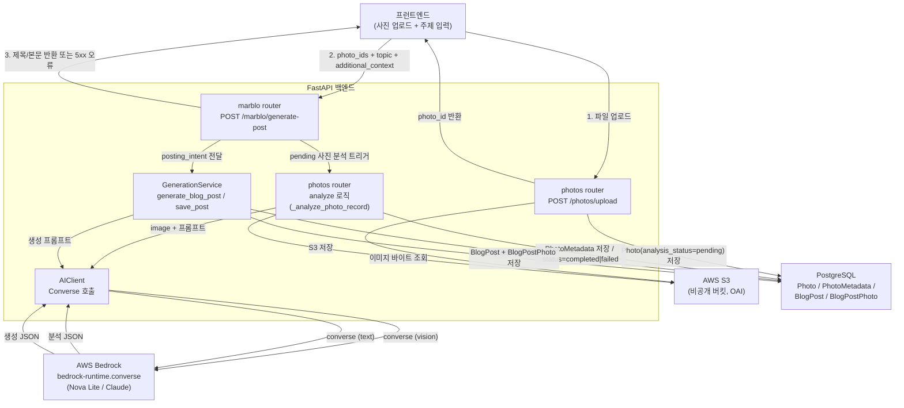

# Design Document

## Overview

이 설계는 Marblo의 AI 블로그 생성 기능을 실제로 동작하게 만드는 것을 목표로 합니다. 현재 `AIClient`는 직접 Anthropic API 경로만 가지고 있고 Bedrock 경로가 비어 있어, `CLAUDE_API_KEY`가 없을 때 `GenerationService._generate_template_draft()`로 조용히 폴백하여 빈 템플릿("[초안] 사진 이야기 - 직접 작성해주세요")을 "성공"으로 반환합니다. 또한 `marblo.py`의 `generate-post`는 `topic`/`additional_context`를 받지만 `generate_post()`로 전달하지 않고, 업로드 후 비전 분석이 자동으로 트리거되지 않아 `PhotoMetadata`가 비어 있습니다.

설계의 핵심 결정은 다음과 같습니다.

1. **AWS Bedrock 실호출 경로 구현**: `AIClient`에 boto3 `bedrock-runtime` 클라이언트 기반 실제 호출 경로를 추가합니다. IAM 역할 자격 증명(EC2 인스턴스 프로파일, 로컬은 boto3 기본 자격 증명 체인)을 사용하며 `CLAUDE_API_KEY`를 요구하지 않습니다. (Req 1)
2. **Bedrock Converse API 채택**: Nova와 Claude는 Bedrock에서 서로 다른 요청/응답 페이로드 구조를 가집니다. 모델별 분기(model-adapter)를 직접 구현하는 대신, 여러 모델 제공자에 걸쳐 스키마를 통일해 주는 **Converse API**(`bedrock-runtime.converse`)를 사용하여 분기를 제거합니다. ([Using the Converse API](https://docs.aws.amazon.com/nova/latest/userguide/using-converse-api.html) — 라이선스 준수를 위해 내용은 재구성함) (Req 1, 2)
3. **설정 가능한 모델**: `app/config.py`에 `bedrock_model_id`(기본값 `amazon.nova-lite-v1:0`), `bedrock_max_tokens`, `use_bedrock`(운영 기본 true)을 추가합니다. (Req 2, 9)
4. **S3 바이트 기반 비전 분석**: S3 버킷은 퍼블릭 접근이 차단(CloudFront OAI 전용)되어 있으므로, `analyze_photo`는 공개 URL 대신 S3에서 이미지 바이트를 메모리로 가져와 Converse `image` 블록으로 전달합니다. Nova Lite는 비전을 지원합니다. ([Multimodal understanding](https://docs.aws.amazon.com/nova/latest/nova2-userguide/using-multimodal-models.html) — 재구성함) (Req 3)
5. **업로드→분석→생성 자동 연결**: `generate-post` 처리 시 요청에 포함된 사진 중 `analysis_status="pending"`인 것을 생성 전에 동기적으로 분석합니다. 월 ~10회의 낮은 사용량을 고려해 동기 처리를 채택합니다. (Req 4)
6. **작성 의도 전달**: `marblo.py`가 `topic`/`additional_context`를 `GenerationService`로 전달하고, 프롬프트 빌더가 이를 반영합니다. (Req 5)
7. **빈 템플릿 폴백 제거**: 생성 실패 시 템플릿을 성공으로 반환하지 않고 명확한 오류(HTTP 5xx)를 표면화합니다. (Req 7)
8. **한국어 출력 + 비용 절약**: 프롬프트가 자연스러운 한국어 작성을 지시하고, 기본 모델은 Nova Lite + `max_tokens` 상한을 사용합니다. (Req 8, 9)

이 설계에는 스키마 마이그레이션이 필요하지 않습니다. 기존 `Photo`, `PhotoMetadata`, `BlogPost`, `BlogPostPhoto` 테이블을 그대로 사용합니다.

## Architecture

### 전체 흐름

`generate-post` 호출 한 번으로 (1) 미분석 사진 분석 → (2) 메타데이터 확보 → (3) 생성 → (4) 저장이 동기적으로 이어집니다.



### 계층 책임

- **marblo router**: 요청 검증, 작성 의도(`posting_intent`) 구성, 분석 파이프라인 트리거, `GenerationService` 호출, 오류를 HTTP 응답으로 변환.
- **photos router / 분석 로직**: 업로드, 그리고 재사용 가능한 사진 분석 함수. 분석 함수는 `generate-post` 파이프라인과 수동 `analyze` 엔드포인트 양쪽에서 호출됩니다.
- **GenerationService**: 메타데이터 컨텍스트 문서 구성, 프롬프트 생성(의도 포함), 생성 결과 파싱, 저장. 템플릿 폴백을 기본 성공 경로에서 제거.
- **AIClient**: Bedrock Converse 호출의 단일 진입점. 텍스트 생성과 비전 분석 모두 Converse로 통일. 재시도/오류 처리 담당.

### Converse API vs 모델별 어댑터 (설계 결정)

Bedrock에서 Nova와 Claude는 `invoke_model`을 쓸 경우 요청 본문(`inferenceConfig` vs `anthropic_version`/`max_tokens`)과 응답 구조가 다릅니다. 두 가지 선택지가 있습니다.

- **선택지 A — `invoke_model` + 모델별 어댑터 레이어**: 모델마다 페이로드를 빌드/파싱하는 분기 코드를 유지해야 하며, 모델을 추가할 때마다 어댑터가 늘어납니다.
- **선택지 B — `converse` API (채택)**: 요청/응답 스키마가 제공자에 걸쳐 통일되어 있어, `messages`/`system`/`inferenceConfig`(maxTokens 등) 하나의 형태로 Nova와 Claude를 모두 호출할 수 있습니다. 이미지도 `image` 블록으로 통일됩니다.

**결정**: 선택지 B를 채택합니다. 트레이드오프로, Converse는 일부 모델 고유 파라미터를 세밀하게 제어하기 어렵고 `additionalModelRequestFields`로만 우회할 수 있지만, 본 기능(텍스트 생성 + 단순 비전 분석)에는 불필요합니다. 모델 교체(Req 2)를 `modelId`만 바꾸면 되도록 단순화하는 이점이 큽니다.

## Components and Interfaces

### 1. `app/config.py` — 설정 추가 (Req 2, 9)

`Settings`에 다음 필드를 추가합니다.

```python
# AI Services (Bedrock)
use_bedrock: bool = os.getenv("USE_BEDROCK", "true").lower() == "true"
bedrock_model_id: str = os.getenv("BEDROCK_MODEL_ID", "amazon.nova-lite-v1:0")
bedrock_max_tokens: int = int(os.getenv("BEDROCK_MAX_TOKENS", "2048"))
bedrock_region: str = os.getenv("BEDROCK_REGION", os.getenv("AWS_REGION", "us-east-1"))
```

- `use_bedrock` 기본값 `true`로 운영 환경에서 Bedrock 경로가 기본 활성화됩니다. (Req 1.1)
- `bedrock_model_id` 기본값은 저비용 Nova Lite이며 환경 변수로 오버라이드 가능합니다. (Req 2.1, 2.2, 9.1, 9.3)
- `bedrock_max_tokens`로 요청당 출력 토큰을 제한합니다. (Req 9.2)
- 기존 `claude_api_key`, `claude_model`은 하위 호환을 위해 남겨두되 Bedrock 경로에서는 사용하지 않습니다. (Req 1.3)

### 2. `app/utils/ai_client.py` — `AIClient` Bedrock Converse 경로 (Req 1, 2, 3)

boto3 `bedrock-runtime` 클라이언트를 지연 초기화하고, 텍스트/비전 호출을 Converse로 통일합니다. boto3 클라이언트에 명시적 키를 전달하지 않아 IAM 역할/기본 자격 증명 체인이 사용됩니다. (Req 1.3)

```python
import base64
import boto3
from botocore.exceptions import ClientError, BotoCoreError

class AIClient:
    MAX_RETRIES = 3
    INITIAL_BACKOFF_SECONDS = 1
    # 재시도 대상: 일시적 서버/스로틀 오류
    RETRYABLE_ERRORS = {"ThrottlingException", "ModelTimeoutException",
                        "ServiceUnavailableException", "InternalServerException"}

    def __init__(self, use_bedrock: bool | None = None):
        self.use_bedrock = settings.use_bedrock if use_bedrock is None else use_bedrock
        self.model_id = settings.bedrock_model_id
        self.max_tokens = settings.bedrock_max_tokens
        self._bedrock = None  # 지연 초기화

    def _get_bedrock_client(self):
        if self._bedrock is None:
            # 명시적 자격 증명을 전달하지 않음 → IAM 역할/기본 체인 사용 (Req 1.3)
            self._bedrock = boto3.client("bedrock-runtime", region_name=settings.bedrock_region)
        return self._bedrock

    async def _invoke_converse(
        self,
        messages: list[dict],
        system_prompt: str | None = None,
    ) -> Optional[str]:
        """Converse API 호출 + 지수 백오프 재시도. 생성 텍스트를 반환. (Req 1.2, 1.4, 2.4, 9.2)"""
        # inferenceConfig.maxTokens = self.max_tokens
        # boto3는 동기 → asyncio.to_thread 로 오프로딩
        ...

    @staticmethod
    def _extract_text(converse_response: dict) -> str:
        """output.message.content 의 모든 text 블록을 순서대로 결합. (Req 1.2)"""
        ...
```

주요 메서드 변경:

- `analyze_photo(image_bytes: bytes, image_format: str, photo_title: Optional[str] = None) -> Optional[dict]`
  - 시그니처 변경: 기존 `image_url: str` → `image_bytes: bytes` + `image_format`. 호출 측이 S3에서 바이트를 가져와 전달합니다. (Req 3.1)
  - Converse `image` 블록(`{"image": {"format": ..., "source": {"bytes": image_bytes}}}`)으로 비전 모델에 전달합니다. Converse API는 원시 바이트를 받습니다(Invoke API는 base64 문자열). ([Image understanding examples](https://docs.aws.amazon.com/nova/latest/userguide/modalities-image-examples.html) — 재구성함)
  - 응답 텍스트를 JSON으로 파싱하여 분석 dict를 반환하고, 파싱 불가 시 `None`을 반환합니다.
- `generate_blog_post(...)`, `analyze_writing_style(...)`, `call_claude(...)`: 내부적으로 `_call_claude` 대신 `_invoke_converse`를 사용하도록 전환합니다. `call_claude`는 호환 유지를 위해 이름을 남기되 Converse로 위임합니다.
- 재시도: `RETRYABLE_ERRORS` 또는 5xx 계열 예외에 대해 최대 3회 지수 백오프. (Req 1.4)

### 3. `app/routers/photos.py` — 재사용 가능한 분석 로직 (Req 3)

수동 `analyze` 엔드포인트와 자동 파이프라인이 공유할 내부 함수를 도입합니다.

```python
async def analyze_photo_record(
    photo: Photo,
    db: AsyncSession,
    s3_client: S3Client,
    ai_client: AIClient,
) -> bool:
    """
    단일 Photo를 분석하여 PhotoMetadata를 upsert하고 analysis_status를 갱신.
    성공 시 True, 실패 시 False. (Req 3.2~3.5)
    """
    # 1) status="analyzing"
    # 2) S3에서 바이트 조회: s3_client.get_object_bytes(photo.s3_key)
    #    (S3Client에 메모리 조회 헬퍼 추가, 아래 5번 참조)
    # 3) ai_client.analyze_photo(image_bytes, photo.file_format, ...)
    # 4) 결과가 None이면 status="failed", 실패 사유 로그, False 반환 (Req 3.4)
    # 5) 결과를 PhotoMetadata 필드로 매핑 (존재하는 항목만, 누락은 None) (Req 3.2, 3.5)
    # 6) status="completed", True 반환 (Req 3.3)
```

- 기존 `analyze_photo` 엔드포인트는 이 함수를 호출하도록 리팩터링합니다. 공개 URL 대신 S3 바이트를 사용하므로, OAI 전용 비공개 버킷에서도 동작합니다. (Req 3.1)
- 매핑은 `description`, `location`, `price`, `date`, `category`, `confidence_scores`를 각각 대응 필드로 저장하며, 확인되지 않은 항목은 `None`으로 둡니다. (Req 3.5)

### 4. `app/routers/marblo.py` — 파이프라인 + 의도 전달 (Req 4, 5, 7)

`generate_post_mvp`를 다음과 같이 변경합니다.

```python
# 1) posting_intent 구성
posting_intent = {"topic": request.topic, "additional_context": request.additional_context}

# 2) 요청된 사진 조회 후 pending 인 것 분석 (Req 4.1, 4.2)
pending = [p for p in photos if p.analysis_status == "pending"]
results = []
for photo in pending:
    ok = await analyze_photo_record(photo, db, s3_client, ai_client)
    results.append(ok)

# 3) 모든 사진이 failed 이면 오류 (Req 4.4, 7.1, 7.2)
if photos and all(p.analysis_status == "failed" for p in photos):
    raise HTTPException(status_code=502, detail="모든 사진 분석에 실패하여 글을 생성할 수 없습니다.")

# 4) 생성 (의도 전달) (Req 5.1)
generated_data = await gen_service.generate_post(
    user_id=current_user.user_id,
    photo_ids=request.photo_ids,
    posting_intent=posting_intent,
    tags=None,
    category=(request.topic.split()[0] if request.topic else None),
)
```

- 생성 예외(RuntimeError/ValueError)는 5xx로 변환하고 실패 원인을 로그에 남깁니다. 템플릿 초안을 성공으로 반환하지 않습니다. (Req 7.1, 7.2, 7.3)
- 분석은 낮은 사용량(~10회/월)을 고려해 **동기**로 수행합니다. 사진당 타임아웃은 `settings.photo_analysis_timeout_seconds`(기본 30초)를 사용합니다. 백그라운드 처리(예: `BackgroundTasks`, 큐)는 상태 폴링/재조회 복잡도를 추가하므로 이 규모에서는 채택하지 않습니다.

### 5. `app/utils/s3_client.py` — 메모리 바이트 조회 헬퍼 (Req 3)

`download_file`은 로컬 경로에 저장하므로, 메모리로 바로 가져오는 헬퍼를 추가합니다.

```python
async def get_object_bytes(self, s3_key: str) -> Optional[bytes]:
    """S3 객체를 메모리로 조회. 재시도 포함. 실패 시 None."""
    # self.s3_client.get_object(Bucket=..., Key=s3_key)["Body"].read()
```

- 비공개 버킷이므로 presigned URL을 모델에 넘기지 않고, 바이트를 직접 읽어 Converse에 전달합니다. (Req 3.1)

### 6. `app/services/generation_service.py` — 의도 반영 + 폴백 제거 (Req 5, 6, 7, 8)

- `generate_blog_post(..., posting_intent: Optional[dict] = None, ...)` 및 `generate_post(..., posting_intent: Optional[dict] = None, ...)`에 `posting_intent`를 추가하고 전달합니다. (Req 5.1)
- `_create_generation_prompt(...)`에 `posting_intent`를 전달하여 `topic`과 `additional_context`를 프롬프트에 명시합니다. 둘 다 비어 있으면 사진 메타데이터만으로 진행합니다. (Req 5.2, 5.3, 5.4)
- 프롬프트를 **한국어 작성 지시**로 변경합니다("자연스러운 한국어로 블로그 본문을 작성하라"). (Req 8.1)
- **템플릿 폴백 제거**: `_call_claude_for_generation`이 `None`을 반환하면 `_generate_template_draft`로 폴백하지 않고 `RuntimeError`를 발생시킵니다. (Req 7.1, 7.2)
  - `_generate_template_draft`는 기본 성공 경로에서 완전히 제거합니다. 명시적 "draft-only" 모드가 향후 필요하면 별도 파라미터로 분리하는 것을 권장하나, 이번 스펙에서는 미포함(제거)합니다.
- 파싱 실패(`_parse_generated_content`의 `ValueError`)는 그대로 전파되어 생성 실패로 처리됩니다. (Req 7.4)
- 컨텍스트 문서는 요청된 **모든 유효 사진**의 메타데이터를 포함합니다(기존 `_fetch_photos_with_metadata`가 이미 리스트를 순회하므로, 다중 사진이 모두 반영되도록 유지·검증). 무효/미소유 사진은 제외하고 로그에 남깁니다. (Req 6.2, 6.3)
- `save_post`는 기존대로 모든 `photo_ids`를 `display_order`와 함께 `BlogPostPhoto`로 연결합니다. (Req 6.4)
- 본문 길이가 `min_length`/`max_length` 범위를 벗어나면 로그에 기록합니다(기존 동작 유지). (Req 8.4)

## Data Models

스키마 변경은 없습니다. 기존 모델의 필드를 아래와 같이 사용합니다.

- **Photo** (`app/models/db_models.py`)
  - `analysis_status`: `pending | analyzing | completed | failed` — 파이프라인이 읽고 갱신. (Req 4.1~4.4)
  - `s3_key`: 이미지 바이트 조회에 사용. (Req 3.1)
  - `file_format`: Converse `image.format`에 사용(`jpeg|png|webp|gif`).
- **PhotoMetadata**
  - `photo_description`, `location_information`(JSON), `price_information`(JSON), `date_and_time`(DateTime), `category`, `confidence_scores`(JSON), `user_verified`. 분석 결과가 이 필드로 매핑됩니다. 확인 안 된 항목은 `None`. (Req 3.2, 3.5)
  - `photo_id`에 unique 제약이 있으므로 재분석 시 기존 레코드를 갱신(upsert)합니다.
- **BlogPost**
  - `title`, `body`, `status="draft"`, `category`. 생성 결과 저장. (Req 8.2)
- **BlogPostPhoto**
  - `post_id`, `photo_id`, `display_order`. 사용된 모든 유효 사진을 순서와 함께 연결. `(post_id, photo_id)` unique. (Req 6.4)
- **GenerationHistory** (기존 동작 유지)
  - `model_used`에 `settings.bedrock_model_id`를 기록하도록 `generation_params`의 `model` 값을 Bedrock 모델 ID로 갱신 권장. (Req 2.4)

작성 의도 전달에 사용하는 요청 스키마(`marblo.py`):

- **GeneratePostRequest**: `photo_ids: List[UUID]`, `topic: Optional[str]`, `additional_context: Optional[str]`. 스키마 자체는 변경 없이, 라우터가 값을 서비스로 전달합니다. (Req 5.1)

## Correctness Properties

*속성(property)은 시스템의 모든 유효한 실행에서 참이어야 하는 특성 또는 동작으로, 시스템이 무엇을 해야 하는지에 대한 형식적 진술입니다. 속성은 사람이 읽는 명세와 기계가 검증 가능한 정확성 보증 사이의 다리 역할을 합니다.*

아래 속성들은 순수 로직(응답 파싱/추출, 결과 매핑, 프롬프트 구성, 오케스트레이션 필터, 연결 보존, 실패 표면화)에 대한 것으로, Bedrock/S3 호출은 모킹하여 우리 코드의 정확성을 검증합니다.

### Property 1: Converse 응답 텍스트 추출 보존

*For any* Converse 응답 구조(`output.message.content`가 임의 개수의 text 블록으로 구성됨)에 대해, `_extract_text`는 모든 text 블록을 원래 순서대로 결합한 문자열을 반환한다.

**Validates: Requirements 1.2**

### Property 2: 분석 결과→PhotoMetadata 매핑 필드 보존

*For any* 유효한(부분적으로 채워진 경우 포함) 분석 결과 dict에 대해, `PhotoMetadata`로의 매핑은 존재하는 항목(description/location/price/date/category)의 값을 보존하고 누락된 항목은 `None`으로 저장한다.

**Validates: Requirements 3.2, 3.5**

### Property 3: 분석 파이프라인 후 pending 잔여 없음

*For any* `analysis_status` 조합을 가진 사진 집합에 대해(분석 함수는 결과를 결정하도록 모킹), 파이프라인 실행 후 `pending` 상태로 남는 사진이 없으며(모두 `completed` 또는 `failed`로 확정), 처음부터 `completed`였던 사진은 재분석되지 않는다.

**Validates: Requirements 4.2**

### Property 4: 프롬프트가 작성 의도를 포함

*For any* `topic` 및 `additional_context` 문자열에 대해, `_create_generation_prompt`가 생성한 프롬프트 문자열에는 제공된 `topic`과 `additional_context`가 모두 포함된다.

**Validates: Requirements 5.2, 5.3**

### Property 5: 모든 유효 사진이 생성 컨텍스트에 포함

*For any* 유효/무효가 섞인 임의 개수의 photo 집합에 대해, 생성 컨텍스트 문서에는 유효한 모든 사진의 메타데이터가 포함되고(개수 보존) 무효/미소유 사진은 포함되지 않는다.

**Validates: Requirements 6.2, 6.3**

### Property 6: 초안-사진 연결의 개수·순서 보존

*For any* 임의 순서의 유효 `photo_ids` 리스트에 대해, 저장 후 생성된 `BlogPostPhoto` 연결의 개수는 입력 개수와 같고 `display_order`는 입력 순서를 보존한다.

**Validates: Requirements 6.4**

### Property 7: 생성 실패 시 템플릿을 성공으로 반환하지 않음

*For any* 생성 실패 모드(모델 응답 `None`, 파싱 불가, 모든 사진 분석 실패)에 대해, `generate_blog_post`는 예외를 발생시키며 성공 결과 dict를 반환하지 않고, 어떤 반환 경로에서도 "[초안] ... 직접 작성해주세요" 형태의 템플릿 문자열을 산출하지 않는다.

**Validates: Requirements 7.1, 7.2**

### Property 8: 파싱 불가 응답은 항상 오류로 신호

*For any* JSON으로 파싱할 수 없거나 `title`/`body` 필드가 누락된 문자열에 대해, `_parse_generated_content`는 항상 `ValueError`를 발생시킨다.

**Validates: Requirements 7.4**

### Property 9: 생성 결과 파싱 라운드트립

*For any* 비어 있지 않은 `title`/`body` 쌍에 대해, 이를 모델 응답 JSON(`{"title": ..., "body": ...}`)으로 직렬화한 뒤 `_parse_generated_content`로 파싱하면 원래 `title`/`body`가 복원된다.

**Validates: Requirements 8.2**

## Error Handling

| 상황 | 처리 | 요구사항 |
|------|------|----------|
| Bedrock 사용 불가 / `use_bedrock`=false & 자격 증명 없음 | `_invoke_converse`가 `None` 반환 → 생성은 `RuntimeError` 발생 → `generate-post`가 HTTP 502/500과 명확한 메시지 반환. 템플릿 미반환. | 7.1, 7.2 |
| 모델 접근 미승인 (`AccessDeniedException`) | 재시도 대상 아님. 즉시 실패로 처리하고 "Bedrock 모델 접근이 활성화되지 않았습니다" 취지의 오류를 로그에 남기고 표면화. | 1.1, 7.1, 7.3 |
| 일시적 서버/스로틀 오류 (5xx, Throttling 등) | 최대 3회 지수 백오프 재시도 후에도 실패하면 `None` 반환 → 생성 실패로 표면화. | 1.4, 7.1 |
| 응답 JSON 파싱 실패 | `_parse_generated_content`가 `ValueError` 발생 → 생성 실패로 전파. | 7.4 |
| 일부 사진 분석 실패 | 해당 사진 `analysis_status="failed"` + 사유 로그. 유효 사진이 하나라도 있으면 생성 진행. | 3.4, 4.3, 6.3 |
| 모든 사진 분석 실패 | `generate-post`가 5xx 오류 반환, 템플릿 미반환. | 4.4, 7.2 |
| S3 바이트 조회 실패 | 해당 사진 분석 실패로 처리(`failed`) + 로그. | 3.4 |
| 파싱 결과에 일부 항목 누락 | 누락 항목은 `None`으로 저장하고 나머지는 정상 저장(부분 성공). | 3.5 |

모든 오류 경로는 `logger`로 실패 원인을 기록합니다. (Req 3.4, 7.3)

## Testing Strategy

### 이중 테스트 접근

- **단위/예시 테스트**: 구체적 시나리오와 엣지 케이스(재시도 횟수 경계, 설정 기본값, 상태 전이, 빈 의도, 다중 업로드, 길이 범위 로깅 등).
- **속성 기반 테스트(PBT)**: 위 Correctness Properties의 순수 로직을 검증. Python에서는 **Hypothesis** 라이브러리를 사용하며, 각 속성 테스트는 **최소 100회** 반복하도록 설정합니다. 각 테스트에는 다음 형식의 태그 주석을 답니다: `# Feature: ai-blog-generation, Property N: <property text>`. 속성 하나당 단일 속성 테스트로 구현합니다.

### 모킹 전략

- **bedrock-runtime**: `boto3` 클라이언트를 모킹하여 `converse` 응답을 주입합니다. 실제 Bedrock 호출 없이 텍스트 추출/파싱/재시도/오류 경로를 검증합니다.
- **S3**: `get_object_bytes`를 모킹하여 임의의 바이트/실패를 주입합니다.
- **DB**: 인메모리 세션 또는 리포지토리 수준 모킹으로 오케스트레이션과 연결 저장을 검증합니다.

### 통합 고려사항 및 전제 리스크

- **Bedrock 모델 접근 활성화 (전제 조건, 리스크)**: 실제 호출이 성공하려면 대상 계정/리전(us-east-1)에서 Bedrock 콘솔의 **Model access**로 Nova Lite(및 사용할 Claude 모델)에 대한 접근이 **활성화**되어 있어야 합니다. 미승인 시 `AccessDeniedException`이 발생합니다. 이는 코드로 해결할 수 없는 배포 전 전제 조건이므로 별도로 확인이 필요합니다.
- **실제 Bedrock 스모크 테스트**: 접근 활성화 후, 1장의 실제 사진으로 업로드→분석→생성 전체 경로를 1회 수동/통합 스모크로 확인하는 것을 권장합니다(속성 테스트 대상 아님).
- 텍스트 생성 품질(자연스러운 한국어, 의도 반영 정도)은 모델 출력 품질에 의존하므로 자동 검증 대상에서 제외합니다. 프롬프트에 한국어 지시가 포함되는지(구조)만 예시 테스트로 검증합니다. (Req 8.1)

### Deployment / Operational notes

- **systemd 서비스 등록 권장**: 현재 백엔드는 systemd 유닛으로 등록되어 있지 않고 `uvicorn`으로 수동 기동됩니다. 인스턴스 재부팅 시 서비스가 자동으로 살아나지 않으므로, `marblo.service` systemd 유닛을 추가하여 부팅 시 자동 시작·비정상 종료 시 재시작(`Restart=always`)되도록 구성하는 것을 권장합니다. (운영 안정성)
- **Bedrock 모델 접근(us-east-1)**: 위 전제 조건과 동일. 배포 전 us-east-1에서 Nova Lite 접근을 활성화해야 합니다.
- **IAM 권한**: EC2 인스턴스 프로파일에 `bedrock:InvokeModel`(및 Converse 사용 시 해당 액션)이 포함되어 있어야 합니다(`terraform/main.tf` 참조). 로컬 개발은 boto3 기본 자격 증명 체인을 사용합니다. (Req 1.1, 1.3)
- **비용**: 기본 Nova Lite + `bedrock_max_tokens` 상한으로 요청당 비용을 통제합니다. 필요 시 환경 변수로 모델/토큰을 조정합니다. (Req 9)
